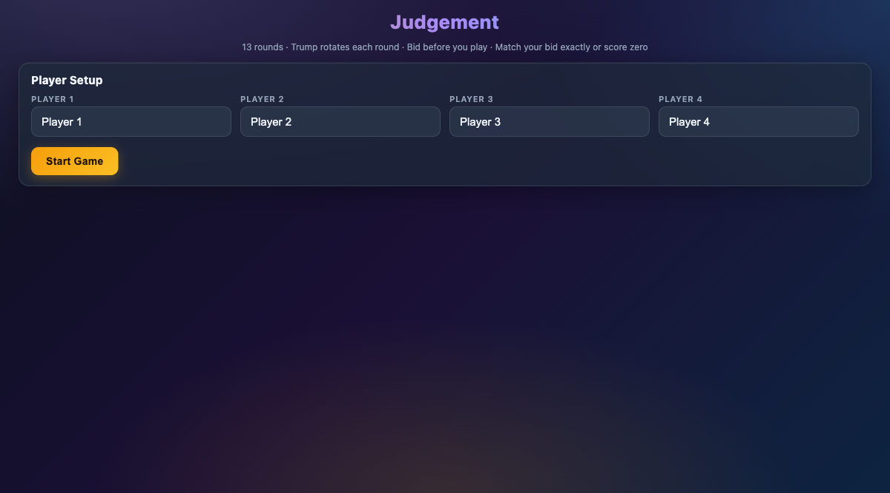
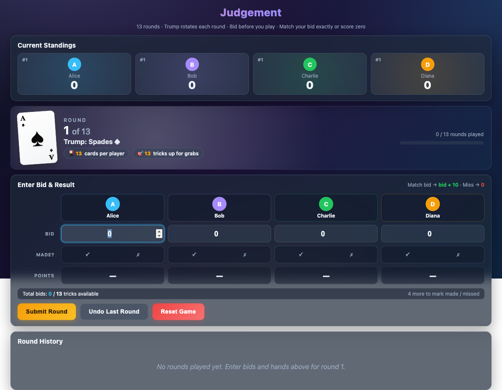

# Judgement - Card Game Scorer

A sleek, offline-first score tracker for the classic **Judgement** (aka Oh Hell) card game. Single HTML file, no dependencies, works in any browser.

## Screenshots

### Player Setup


### Gameplay


## Features

- **4-player scoring** across 13 rounds
- **Trump suit rotation** with visual playing card display
- **Bid tracking** — match your bid exactly for `bid + 10` points, miss and score zero
- **Live standings** with rank indicators
- **Round history** table with per-round breakdowns
- **Undo** last round if you make a mistake
- **Fully offline** — no server, no install, just open the HTML file

## How to Play

1. Enter player names and hit **Start Game**
2. Each round: enter bids, mark who made their bid, then submit
3. After 13 rounds, the winner is announced

## Quick Start

```bash
# Clone and open
git clone https://github.com/shtarun/judgement-game.git
cd judgement-game
./run.sh

# Or just open index.html in your browser
```

## Rules Refresher

- 13 rounds, cards dealt decrease then increase (13 → 1 → 13)
- Trump suit rotates: Spades, Diamonds, Clubs, Hearts
- Before each round, players bid how many tricks they'll win
- Scoring: match your bid = `bid + 10` points; miss = `0` points
- Highest total after all rounds wins

## License

MIT
